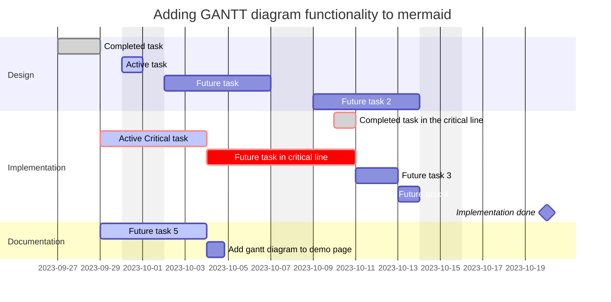

# Markdown Examples

# Heading 1
## Heading 2
### Heading 3

---

## Bullet points
- One
- Two
    - Nested
- Three

## Numbered List
1. One
2. Two
     1. Nested
3. Three

## Checklists
- [ ] One
- [ ] Uncompleted
     - [ ] Nested
- [x] Completed

## Seperators
---
***
___

## Tables
 | Column 1 | Right Aligned | Centre Aligned |
 | --- | ---: | :---: |
 | Universe | 42 | Hitchhicker |
 | Data | 6060 | Lorem Ipsum |
 | Data | 987789 | Lorem Ipsum |

## Code Highlighting
- Code can be `highlighted inline` or in blocks:
```C++
#include <iostream>
void main()
{
	std::cout << "Hello World\n";
}
```

## Gantt Chart


## Whole Examples
- [weekly minutes example](weekly%20minutes%20example.md)
- [weekly log example](weekly%20log%20example.md)  

I also created a couple of templates if anyone wishes to use them:  
- [weekly minutes template](weekly%20minutes%20template.md)  
- [weekly log template](weekly%20log%20template.md)